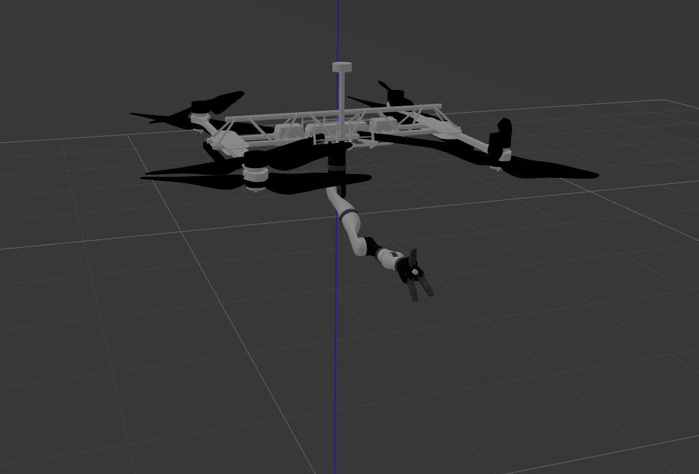

# Aerial-Manipulator-Gazebo
Aerial Manipulator for Gazebo Simulation

This package depends on the [RotorS Simulator](https://github.com/ethz-asl/rotors_simulator) for Gazebo-ROS simulation of an Aerial Manipulation System.
The aerial manipulator consists of the HarrierD7 Vulcan UAV and the [Kinova](https://github.com/Kinovarobotics/kinova-ros) 7DoF spherical wrist robot manipulator.

### Instructions

1. First of all, download and install the [RotorS Simulator](https://github.com/ethz-asl/rotors_simulator) in your workspace, preferably using either `catkin_make` or `catkin build`
2. Make sure you have downloaded [Eigen](http://eigen.tuxfamily.org/index.php?title=Main_Page). If your install folder for the Eigen headers is not `usr/include/eigen3` you will need to edit the `CMakeList.txt` file
3. Clone this repository to your workspace with:
```
cd ~/catkin_ws/src
git clone git@github.com:RISC-NYUAD/Aerial-Manipulator-Gazebo.git
```
and run `catkin_make` or `catkin build` once again

4. Run `roslaunch aerial_manipulation aerial_manipulator.launch` to test the default system



### Further usage
* In a new terminal, run
```
roslaunch aerial_manipulation uav_teleop.launch
```
to send discrete position and yaw orientation commands to the UAV

* In another terminal, run
```
roslaunch aerial_manipulation robot_teleop.launch
```
to send discrete joint angle commands to the robot

* Run `roslaunch aerial_manipulation pick_weight.launch` and use the UAV and Robot teleoperators to try your hand at a realistic weight-lifting scenario using the Aerial Manipulator
 
* For expanded usage, we suggest downloading and installing the [Kinova](https://github.com/Kinovarobotics/kinova-ros) packages, for more robot descriptions and functionalities 
* Has been test for Gazebo 7
